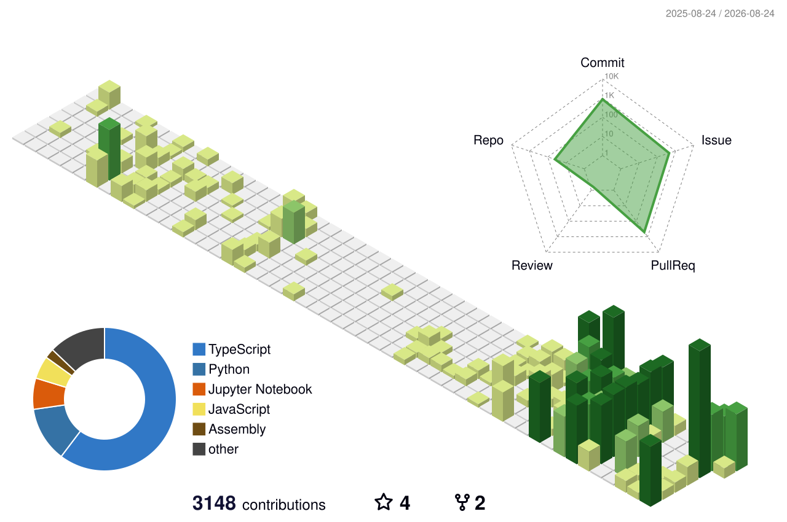
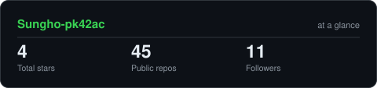

<picture>
  <source media="(prefers-color-scheme: dark)" srcset="./assets/profile-hero-dark-v3.svg">
  <source media="(prefers-color-scheme: light)" srcset="./assets/profile-hero-light-v3.svg">
  
</picture>

<div align="center">

[](https://tokscale.ai/u/Sungho-pk42ac)


</div>

---

## `~/` whoami

```console
$ whoami
pk42ac · 박성호 — AI Security & AgentOps Builder

$ cat mission.txt
AI coding agents, MCP, PR diffs, transcripts, and LLM workflows
are becoming a new security surface.
I build practical tools that make those workflows
observable, governable, and hard to misuse.

$ _
```

<div align="center">

## `~/` toolbox


</div>

---

<div align="center">

## `~/` language radar

<!-- Generated from public repository language byte counts. -->
<picture>
  <source media="(prefers-color-scheme: dark)" srcset="assets/radar-langs-dark.svg">
  <source media="(prefers-color-scheme: light)" srcset="assets/radar-langs-light.svg">
  
</picture>

</div>

---

<div align="center">

## `~/` contribution calendar

<!-- Regenerated daily by .github/workflows/metrics.yml. -->
<picture>
  <source media="(prefers-color-scheme: dark)" srcset="profile-3d-contrib/profile-night-green.svg">
  <source media="(prefers-color-scheme: light)" srcset="profile-3d-contrib/profile-green-animate.svg">
  
</picture>

<br><br>

<!-- Regenerated daily by .github/workflows/snake.yml. -->
<picture>
  <source media="(prefers-color-scheme: dark)" srcset="https://raw.githubusercontent.com/Sungho-pk42ac/Sungho-pk42ac/output/snake-dark.svg">
  <source media="(prefers-color-scheme: light)" srcset="https://raw.githubusercontent.com/Sungho-pk42ac/Sungho-pk42ac/output/snake.svg">
  
</picture>

</div>

---

<div align="center">

## `~/` the numbers

<!-- Generated into this repository by scripts/cards.py. -->
<picture>
  <source media="(prefers-color-scheme: dark)" srcset="assets/card-stats-dark.svg">
  <source media="(prefers-color-scheme: light)" srcset="assets/card-stats-light.svg">
  
</picture>

</div>

---

<div align="center">

<sub>`01100010 01110101 01101001 01101100 01100100 00100000 01110100 01110010 01110101 01110011 01110100 01110111 01101111 01110010 01110100 01101000 01111001 00100000 01100001 01101001`</sub>

</div>
