<picture>
  <source media="(prefers-color-scheme: dark)" srcset="./assets/profile-hero-dark-v2.svg" />
  <source media="(prefers-color-scheme: light)" srcset="./assets/profile-hero-light-v2.svg" />
  
</picture>

<div align="center">

# pk42ac · 박성호

**AI Security & AgentOps Builder**

AI coding agents, MCP, PR diffs, transcripts, and LLM workflows are becoming a new security surface.<br>
I build practical tools that make those workflows **observable, governable, and hard to misuse**.

[](https://tokscale.ai/u/Sungho-pk42ac)

</div>

---

## Selected work

<table>
  <tr>
    <td width="50%">
      <h3><a href="https://github.com/Sungho-pk42ac/agentguard">AgentGuard</a></h3>
      <p><b>AgentOps security scanner</b> for AI coding agents, MCP configs, transcripts, and PR diffs.</p>
      <sub>TypeScript CLI · SARIF · GitHub Actions · control-plane direction</sub>
    </td>
    <td width="50%">
      <h3><a href="https://github.com/Sungho-pk42ac/Document-classification-CSO">Document-classification-CSO</a></h3>
      <p>Qwen3-14B LoRA classifier for Korean C/S/O document security labels.</p>
      <sub>FastAPI · Web UI · Hugging Face · evaluation metrics</sub>
    </td>
  </tr>
  <tr>
    <td width="50%">
      <h3><a href="https://github.com/Sungho-pk42ac/kisia-project">AI DLP</a></h3>
      <p>Detects and blocks sensitive-data leakage across generative-AI workflows.</p>
      <sub>PII detection · policy engine · dashboard</sub>
    </td>
    <td width="50%">
      <h3><a href="https://github.com/Sungho-pk42ac/dacon-2026-skku-multimodal-ai-bias-challenge">DACON SKKU Bias Challenge</a></h3>
      <p>Multimodal VQA bias-mitigation solution with an abstention-aware policy.</p>
      <sub>Qwen3-VL · GRPO · reproducible submission pipeline</sub>
    </td>
  </tr>
</table>

## Direction

```text
AI agents should be useful, observable, and hard to misuse.
```

- Secure AI-agent workflows before they touch production systems.
- Turn AI security ideas into working CLIs, dashboards, and reproducible pipelines.
- Keep projects small enough to understand and complete enough to run.

## Stack

<p>
  
  
  
  
  
  
  
  
  
  
</p>
